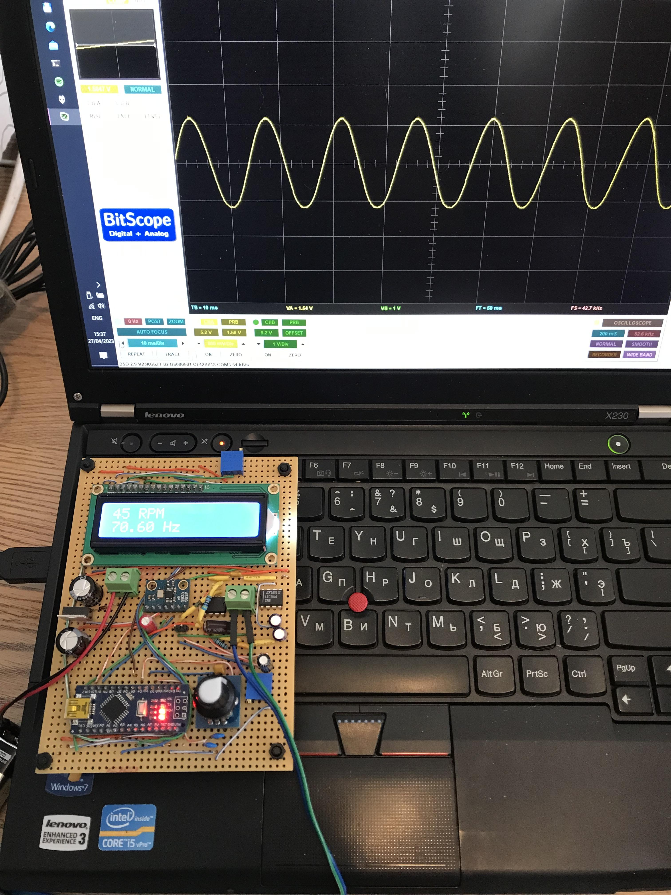
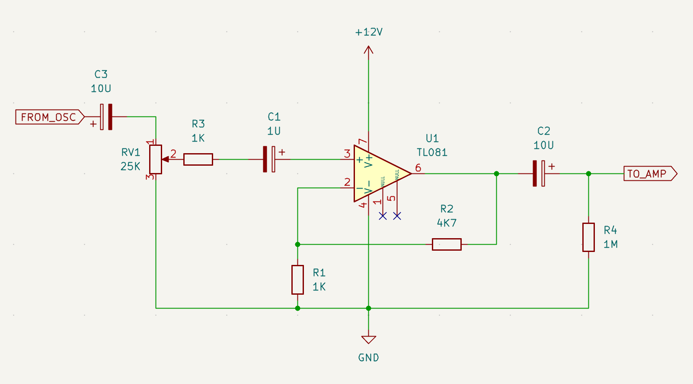

# AD9833 DDS oscillator for turntable speed control

This repository contains the source code for my turntable speed control project. The scope of the project was to design an oscillator board that could be used instead of the XR2206-based analogue oscillator in the [Nigel's Speed Controller](https://www.lencoheaven.net/forum/index.php?topic=13981.0).

This project uses the [Arduino AD9833 Library by Bill Williams](https://github.com/Billwilliams1952/AD9833-Library-Arduino).

To build an oscillator, you would need the following parts:

- Arduino Nano V3 clone;
- AD9833-based function generator module;
- 1602A display module;
- rotary encoder with or without built-in momentary switch;
- momentary switch button (if your rotary encoder doesn't have one);
- resistors, capacitors, jumper wires and other assorted bits and bobs.

## Connections

The code assumes the following connections between the components.

**Rotary encoder / button:**

- encoder A to Arduino D2;
- encoder B to Arduino D4;
- encoder SW (or your standalone momentary button) to Arduino D3.

**AD9833 module:**

- AD9833 DATA to Arduino D11;
- AD9833 CLK to Arduino D13;
- AD9833 FNC to Arduino D10.

**1602A LCD module:**

- LCD D7 to Arduino A0;
- LCD D6 to Arduino A1;
- LCD D5 to Arduino A2;
- LCD D4 to Arduino A3;
- LCD E to Arduino A5;
- LCD RS to Arduino D5.

Other connections (power, LCD contrast etc.) should be made according to the relevant specifications.

## Input debouncing

The source code does not take any measures to detect bouncing; I have found that placing small ceramic capacitors (between 100pF and 1nF) between input pins and ground is enough to stop any spurious input from occurring.

## Output voltage

The main downside of the AD9833 is that the output ampltude for sine wave is only about 600 mV which is not enough to drive the output amplifier in the NSC. Therefore it would be necessary to implement some sort of a gain stage. The following circuit using the TLC081CP single-rail operational amplifier should work well enough for our purposes and produce more than 3V of output voltage.

## User interface

The user interface is extremely simple. When the oscillator is first powered on, it initialises the built-in EEPROM using the default frequency values (50Hz for 33.3 RPM and 67.5Hz for 45RPM). Press the button (either the built-in button in the rotary encoder or the separate button if you're using one) to switch between 33 and 45 RPM. Rotating the rotary encoder changes the frequency. To avoid wearing out the flash memory prematurely, the controller waits 5s before writing the new frequency values, and they're written only if the new value is not equal to the old one. 

## License etc.

The source code is released under the terms of GPLv2 or later. All the information on this page can be used freely for any purposes, including commercial. 
